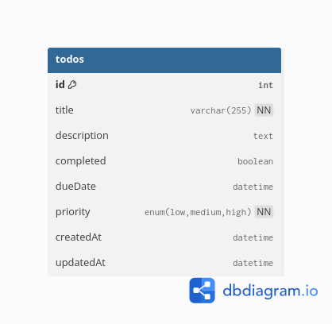

# ✅ Taskify — Simple To-do List Management Application

**Taskify** is a full-stack NodeJS REST API application that implements a simple To-do list.
It allows users to create, read, update, and delete to-do items, set priorities, and track due dates.
The application persists data in a MySQL database and runs entirely in Docker containers, demonstrating containerized backend development.

## 🚀 Features

### 📅 **Tasks Tracking**

- Create a To-do item with title, description, due date, and priority
- Retrieve a single To-do item by ID
- Retrieve all To-do items
- Update a To-do item (including completion status and priority)
- Delete a To-do item
- Handles invalid input gracefully with proper HTTP status codes

### ⚙️ **Automation**

- Docker image build
- MySQL & NodeJS container startup
- Sequelize model synchronization

## 🏗️ Tech Stack

| Component            | Technology                       |
| -------------------- | -------------------------------- |
| **Backend**          | NodeJS, Express                  |
| **Database**         | MySQL, Sequelize ORM             |
| **Containerization** | Docker & Docker Compose          |
| **Scripting**        | Bash (startup.sh) for automation |

## 📖 API Documentation

### 🧾 Create Task Item

- **Method**: `POST`
- **Endpoint**: `/todos/`
- **Description**: Create a new Tast Item.
- **Request Body**:
  ```json
  {
    "title": "finish task",
    "description": "leetcode challenge",
    "completed": false,
    "dueDate": "2025-12-02",
    "priority": "high"
  }
  ```
- **Response** (`201 CREATED`):
  ```json
  {
    "id": 1,
    "title": "finish task",
    "description": "34ML challenge",
    "completed": false,
    "dueDate": "2025-12-02T00:00:00.000Z",
    "priority": "high",
    "updatedAt": "2025-11-29T14:43:09.170Z",
    "createdAt": "2025-11-29T14:43:09.170Z"
  }
  ```

---

### 📨 Apply for Loan

- **Method**: `PATCH`
- **Endpoint**: `/api/loans/customer/apply/<loan_id>/`
- **Description**: Customer submits the draft loan for approval.
- **Response** (`200 OK`):
  ```json
  {
    "id": 3
  }
  ```

---

### 👀 List all created tasks

- **Method**: `GET`
- **Endpoint**: `/todos`
- **Description**: Retrieve all task items.
- **Response** (`200 OK`):
  ```json
  [
    {
      "id": 2,
      "title": "finish task 2",
      "description": "leetcode challenge",
      "completed": false,
      "dueDate": "2025-12-02T00:00:00.000Z",
      "priority": "high",
      "createdAt": "2025-11-29T14:55:20.000Z",
      "updatedAt": "2025-11-29T14:55:20.000Z"
    },
    {
      "id": 1,
      "title": "finish task",
      "description": "codeforces challenge",
      "completed": false,
      "dueDate": "2025-12-02T00:00:00.000Z",
      "priority": "high",
      "createdAt": "2025-11-29T14:43:09.000Z",
      "updatedAt": "2025-11-29T14:43:09.000Z"
    }
  ]
  ```

---

### 👀 get Task item

- **Method**: `GET`
- **Endpoint**: `/todos/{id}
- **Description**: Retrieve task item by id
- **Response** (`200 OK`):
  ```json
  {
    "id": 1,
    "title": "finish task",
    "description": "codeforces challenge",
    "completed": false,
    "dueDate": "2025-12-02T00:00:00.000Z",
    "priority": "high",
    "createdAt": "2025-11-29T14:43:09.000Z",
    "updatedAt": "2025-11-29T14:43:09.000Z"
  }
  ```

---

### ✅ update Task item

- **Method**: `PUT`
- **Endpoint**: `/todos/{id}`
- **Description**: update task item
- **Request Body**:
  ```json
  {
    "completed": true
  }
  ```
- **Response** (`200 OK`):
  ```json
  {
    "id": 1,
    "title": "finish task",
    "description": "codeforces challenge",
    "completed": true,
    "dueDate": "2025-12-02T00:00:00.000Z",
    "priority": "high",
    "createdAt": "2025-11-29T14:43:09.000Z",
    "updatedAt": "2025-11-29T14:43:09.000Z"
  }
  ```

---

### ❌ Delete TAsk Item

- **Method**: `DELETE`
- **Endpoint**: `/todos/{id}`
- **Description**: Delete taskitem by id.
- **Response** (`204 Not Content`):

  ```

  ```

---

## 🗄️ Database Schema

The application uses MySQL database with a single table todos:



## Running the Application

### Prerequisites

- Docker & Docker Compose installed
- Linux

### Setup

1. Clone the repository:

```bash
git clone <repo-url>
cd Taskify
```

2. Set up environment variables in .env it is public for evaluation:

```
DB_HOST=db
DB_USER=root
DB_PASSWORD=password
DB_NAME=mydb
DB_PORT=3306
PORT=8080
NODE_ENV=production
```

3. Start the application:

```bash
./startup.sh
```

### Notes

- MySQL root password is hardcoded as password

- Docker volumes ensure data persists between container restarts

- NodeJS listens internally on port 8080 and maps to host port 10279

- there is branch with auth feature jwt

## 🙏 Acknowledgments

- This project was developed as part of the 34ML Blockchain Specialist Assessment.

- Special thanks to the 34ML team for providing the evaluation guidelines and resources.

- Inspired by various open-source NodeJS and Docker tutorials for API development and containerization best practices.
